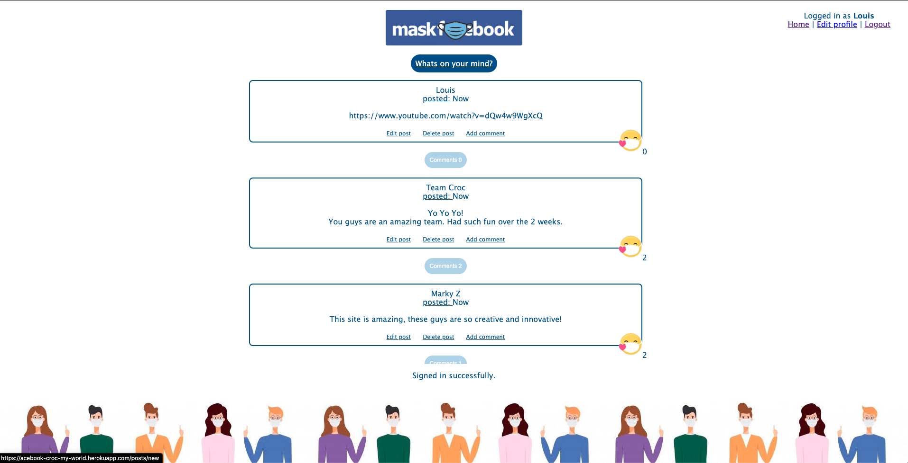
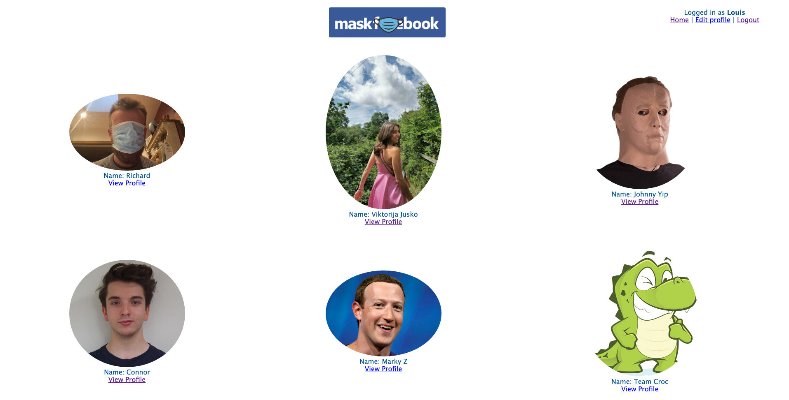
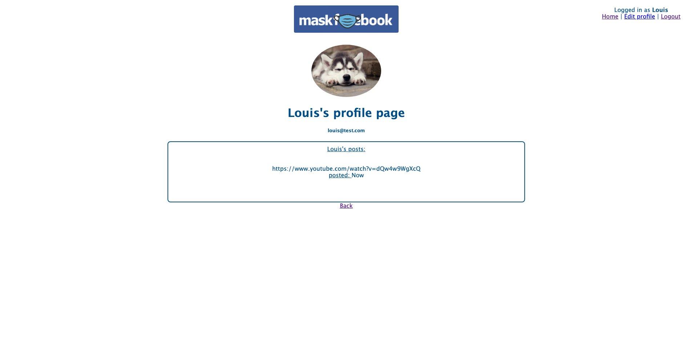

# Maskbook

Maskbook is a social media app that serves as a reminder to keep each other safe. It is also a celebration that facemasks are not a restriction but can be a statement of personality.

## Motivation
As part of Makers Academy students were challenged to learn Ruby on Rails and make an Acebook app within two weeks. The emphasis is on showing the ability to learn a new framework in a short amount of time and continued development of team work skills.
 
## Screenshots
The home page displays all user posts
  
All users are displayed in a grid - click on a user to request friendship

Each user profile page display all their own posts


## Tech/framework used

<b>Built with</b>
- [Ruby on Rails 6.0.3.4](https://rubyonrails.org/)
- [Ruby 2.5.0](https://www.ruby-lang.org/en/)
- [Postgresql 13.0](https://www.postgresql.org/)
- [Devise 4.7.3](https://github.com/heartcombo/devise)
  
<b>Tested with</b>
- [Rspec 3.9.3](https://rspec.info/)
- [Capybara 2.18.0](https://github.com/teamcapybara/capybara)
- [Selenium Webdriver 3.142.7](https://www.selenium.dev/documentation/en/webdriver/)
- [FactoryBot Rails 6.1.0](https://github.com/thoughtbot/factory_bot_rails)
- [Faker 2.14.0](https://github.com/fzaninotto/Faker)

<b>Deployed with</b>
- [Heroku](https://acebook-croc-my-world.herokuapp.com/)
- [Amazon S3](https://docs.aws.amazon.com/AmazonS3/latest/dev/Versioning.html)
- [Circle CI](https://github.com/circleci)

## Features
* User authentication - redirects to the login page when not signed in
* User registration - a user can register with name, profile pic, email address and password
* If no profile pic is uploaded a default avatar is used
* Secure password - password encryption is used on the database and passwords are not visible on signing in
* Users can view other registered users and make friend requests to other users
* Users can decline friend requests
* Users can post a public message which is shown on their profile page
* Users can edit messages within 10 minutes of creation
* Users can add and edit comments below messages
* Users can like and unlike messages
* Users can only edit our delete their own messages
* Users can view profile pages of their friends


## Installation and local development

+ Check out the repository  
```
  git clone https://github.com/TheDancingClown/Croc-My-World  
  cd Croc-My-World
```
+ Install required gems  
```
   bundle install
```
+ Create the database  
```
  rails db:create  
  rails db:migrate
```
+ Start the server
``` 
  rails server
```
+ View the app in your browser 
``` 
  visit localhost:3000
```


## Tests
Inside your project directory run
```  
  rspec
```

## How to use?
Visit https://acebook-croc-my-world.herokuapp.com/  
Register for a new account via the signup page and follow the links shown to make posts, add comments, like posts and add new friends

## Credits
Team Croc is:
* [Connor Worthington](https://github.com/CRTW26)
* [Johnny Yip](https://github.com/JYip93)
* [Louis Kirkham](https://github.com/TheDancingClown)
* [Richard Pryce](https://github.com/prycey77)
* [Viktorija Jusko](https://github.com/vikjusko) 
 
You can follow our development journey via the [Wiki](https://github.com/TheDancingClown/Croc-My-World/wiki) where each team member summarised leading a two day sprint.


